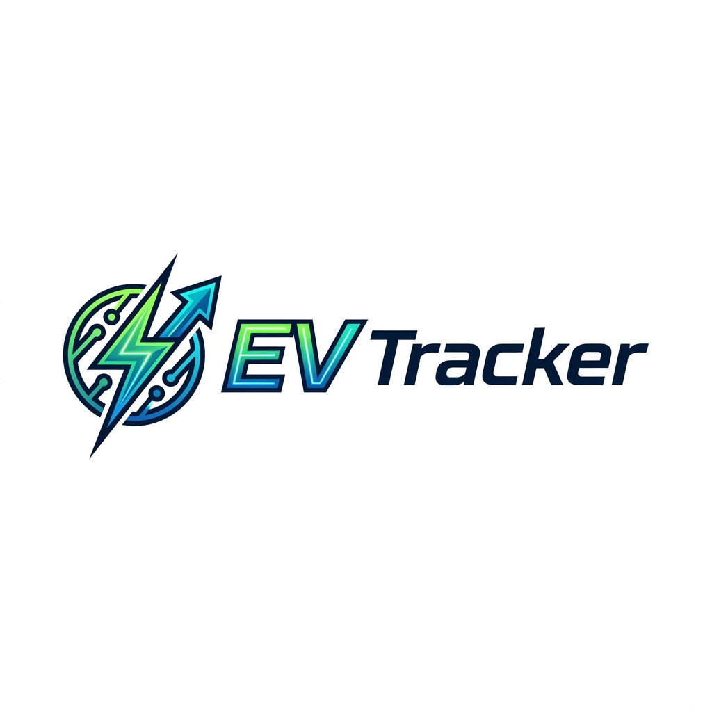

# ⚡ Tesla EV Tracker: Next-Gen Fleet Intelligence

<p align="center">
  
  &nbsp;
  
  &nbsp;
  
</p>

---

## 🌐 Overview

**Tesla EV Tracker** is a state-of-the-art fleet management and telemetry platform designed for the futuristic electric vehicle ecosystem. Built with a focus on **Tesla aesthetics**, **real-time intelligence**, and **seamless user experience**, this platform provides fleet operators and owners with deep insights into their EV performance, location, and charging status across the United States.

---

## ✨ Key Features

### 📍 Real-Time Telemetry
- **Live GPS Tracking**: Monitor your fleet on a high-precision Mapbox-powered interface.
- **US-Centric Geofencing**: Optimized for North American operations with precise bounding boxes and regional data.

### 📊 Advanced Analytics
- **Battery Health Monitoring**: Detailed SoC (State of Charge) and SoH (State of Health) metrics.
- **Range Prediction**: Intelligent algorithms to predict remaining range based on driving modes (Economy, Formula, Sports).
- **Trip History**: Comprehensive logs of every journey, distance, and energy consumption.

### 🔋 Charging Ecosystem
- **Hub Discovery**: Locate Tesla Superchargers and partner charging stations in real-time.
- **Dynamic Connector Data**: Real-time status on socket types (2Phase/3Phase) and power outputs (AC/DC FAST).

### 🎨 Premium UI/UX
- **Tesla Branding**: A sleek, dark-mode inspired interface that aligns with the Tesla brand identity.
- **Micro-Animations**: Smooth, 60fps CSS transitions, staggered loading states, and responsive hover effects.
- **Persistent Sidebar**: Optimized navigation for power users.

---

## 🛠️ Tech Stack

<p align="left">
  
  
  
  
</p>
<p align="left">
  
  
  
  
</p>
<p align="left">
  
  
  
</p>

---

## 🚀 Getting Started

Experience the future of fleet management in minutes.

### Prerequisites
- [Docker](https://www.docker.com/get-started)
- [Docker Compose](https://docs.docker.com/compose/install/)

### Installation

1. **Clone the repository**
   ```bash
   git clone https://github.com/bhuvanthirwani/EV-Tracker.git
   cd EV-Tracker
   ```

2. **Configure Environment**
   Ensure your `.env` files are set up for both frontend and backend. Specifically, provide your `MAPBOX_TOKEN`.

3. **Launch with Docker**
   ```bash
   docker compose up --build
   ```

4. **Access the App**
   Open [http://localhost:3000](http://localhost:3000) in your browser.

---

## 🏗️ Architecture

The project follows a modern microservices-adjacent architecture:

1. **Frontend**: A highly responsive React SPA served with optimized Webpack configurations.
2. **Backend**: A high-performance FastAPI server providing RESTful endpoints for vehicle and telemetry data.
3. **Generator**: A dedicated Python service that simulates real-world vehicle telemetry via high-frequency API updates.

---

## 📄 License

This project is licensed under the MIT License - see the [LICENSE](LICENSE) file for details.

---

## 👤 Author

**Bhuvan Thirwani**  
*Full Stack AI Developer & EV Enthusiast*

---

<p align="center">
  Developed with ❤️ for the Electric Future.
</p>
